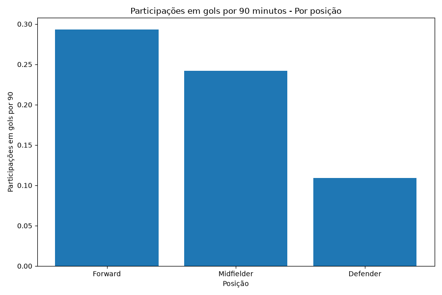
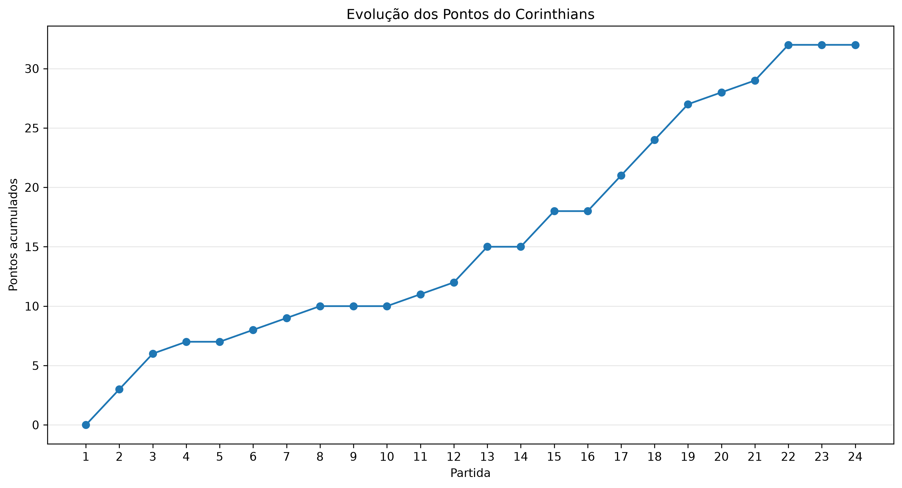
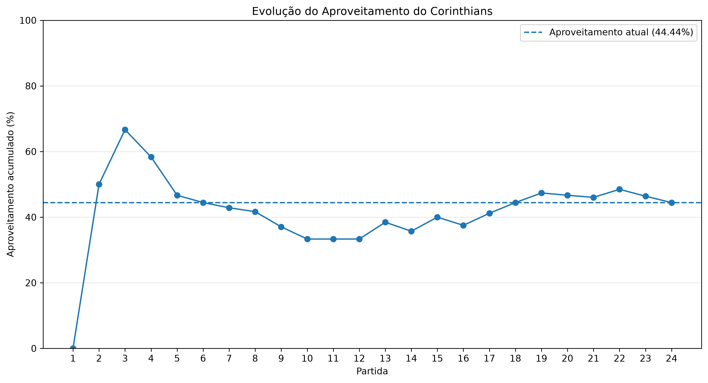

# ⚽ Corinthians Data Analytics

Projeto de análise de dados desenvolvido para acompanhar o desempenho do **Sport Club Corinthians Paulista no Campeonato Brasileiro de 2026**, utilizando dados públicos disponibilizados pela ESPN.

O projeto realiza a extração, tratamento, validação e análise dos dados, além de disponibilizar um **dashboard interativo em Streamlit** com informações da equipe e dos jogadores.

---

## 📊 Objetivo do projeto

O objetivo é construir um pipeline completo de dados aplicado ao futebol, passando pelas principais etapas de um projeto de Data Analytics:

- Extração de dados
- Tratamento e transformação
- Validação da qualidade dos dados
- Engenharia de métricas
- Análise exploratória
- Visualização
- Construção de dashboard interativo
- Automação da atualização dos dados

O projeto foi desenvolvido pensando principalmente em práticas utilizadas nas áreas de **Data Analytics, Business Intelligence e Data Science**.

---

# 🚀 Dashboard

O dashboard foi desenvolvido utilizando **Streamlit e Plotly**.

Ele possui três áreas principais:

### 📊 Visão geral

Apresenta indicadores gerais da campanha:

- Jogos disputados
- Pontos conquistados
- Aproveitamento
- Saldo de gols
- Vitórias
- Empates
- Derrotas
- Gols feitos e sofridos
- Último jogo
- Forma recente
- Evolução dos pontos
- Evolução do aproveitamento

---

### 👤 Jogadores

Permite analisar o desempenho individual dos atletas.

Principais recursos:

- Filtro por posição
- Filtro por quantidade mínima de minutos
- Ranking de participações em gols por 90 minutos
- Artilharia
- Ranking de assistências
- Perfil individual do jogador
- Gols por 90 minutos
- Assistências por 90 minutos
- Participações em gols por 90 minutos
- Finalizações por 90 minutos
- Comparação entre dois jogadores

As posições são organizadas em:

- Atacante
- Meio campista
- Defensor
- Goleiro

Quando a posição geral de um atleta não está disponível diretamente no cadastro do elenco, o sistema tenta inferi-la a partir das posições registradas nas partidas.

---

### ⚽ Partidas

Área dedicada ao desempenho coletivo do Corinthians.

Inclui:

- Desempenho em casa
- Desempenho fora
- Aproveitamento por mando
- Resultados
- Pontos conquistados
- Gols feitos
- Gols sofridos
- Histórico das partidas disputadas

---

# 🔄 Pipeline de dados

O projeto possui um pipeline automatizado para atualização das informações.

O fluxo principal funciona da seguinte maneira:

```text
ESPN
  ↓
Extração do elenco
  ↓
Tratamento dos jogadores
  ↓
Extração das estatísticas por partida
  ↓
Validação dos dados
  ↓
Cálculo dos minutos jogados
  ↓
Criação das métricas por 90 minutos
  ↓
Extração dos resultados das partidas
  ↓
Transformação dos dados da campanha
  ↓
Dashboard
```

Todo o pipeline pode ser executado com apenas um comando:

```bash
python src/update_data.py
```

Também existe um botão dentro do próprio dashboard:

```text
🔄 Atualizar dados
```

que executa automaticamente o processo de atualização.

---

# 🧠 Tratamento dos minutos jogados

A ESPN não fornece diretamente uma coluna consolidada de minutos jogados para cada atleta em todas as partidas.

Por isso, o projeto calcula os minutos utilizando informações como:

- Titularidade
- Entrada por substituição
- Saída por substituição
- Expulsões
- Tempo do evento registrado pela ESPN

Exemplo:

```text
Jogador titular
Entrada: 0 min
Substituição: 70 min

Minutos jogados = 70
```

Para jogadores expulsos, o minuto da expulsão também é considerado.

Isso evita que um atleta expulso aos 45 minutos, por exemplo, seja incorretamente contabilizado com 90 minutos jogados.

---

# 📐 Métricas por 90 minutos

Para tornar as comparações entre jogadores mais justas, o projeto utiliza métricas normalizadas pelo tempo em campo.

A fórmula utilizada é:

```text
Métrica por 90 =
Métrica total / (Minutos jogados / 90)
```

Exemplo:

```text
Jogador:

900 minutos
5 gols

900 / 90 = 10 partidas completas equivalentes

5 / 10 = 0,50 gol por 90 minutos
```

Entre as métricas calculadas estão:

- Gols / 90
- Assistências / 90
- Participações em gols / 90
- Finalizações / 90
- Finalizações no gol / 90

Para rankings de eficiência, o dashboard permite definir uma quantidade mínima de minutos, reduzindo distorções causadas por jogadores com pouca participação.

---

# 🧹 Tratamento das posições

As posições fornecidas durante as partidas podem aparecer de maneiras muito específicas, como:

```text
Attacking Midfielder
Right Midfielder
Center Left Midfielder
Left Back
Center Right Defender
```

O projeto transforma essas funções táticas em categorias gerais:

```text
Forward       → Atacante
Midfielder    → Meio campista
Defender      → Defensor
Goalkeeper    → Goleiro
```

Valores como:

```text
Substitute
Desconhecida
```

não são considerados posições válidas.

Caso a posição não esteja disponível no cadastro principal do elenco, o sistema utiliza as posições registradas nas partidas e seleciona a categoria mais frequente.

---

# ✅ Validação dos dados

Antes da criação das métricas, o projeto realiza verificações para identificar possíveis inconsistências.

Entre as validações realizadas estão:

- Registros duplicados
- Valores ausentes
- Minutos negativos
- Minutos acima de 90
- Número de jogadores registrados por partida
- Quantidade de partidas processadas
- Quantidade de jogadores
- Cartões vermelhos
- Minutos de atletas expulsos

Esse processo ajuda a evitar que erros da fonte ou da transformação afetem as análises finais.

---

# 📈 Algumas análises desenvolvidas

Durante o projeto foram realizadas análises como:

### Produção ofensiva por posição

Comparação entre:

- Atacantes
- Meio-campistas
- Defensores

utilizando métricas normalizadas por 90 minutos.



---

### Evolução dos pontos

Acompanhamento da pontuação acumulada do Corinthians ao longo do campeonato.



---

### Evolução do aproveitamento

Análise da variação do aproveitamento acumulado ao longo das partidas.



---

# 🛠️ Tecnologias utilizadas

### Linguagem

- Python

### Manipulação e análise de dados

- Pandas
- NumPy

### Visualização

- Matplotlib
- Plotly

### Dashboard

- Streamlit

### Consumo de dados

- Requests
- JSON
- APIs/endpoints HTTP

### Outros conceitos utilizados

- ETL
- Data Cleaning
- Data Validation
- Feature Engineering
- Análise Exploratória de Dados
- Métricas normalizadas
- Automação de pipeline
- Git / GitHub

---

# 📁 Estrutura do projeto

```text
corinthians-data-analytics/
│
├── dashboard/
│   └── app.py
│
├── data/
│   │
│   ├── raw/
│   │   ├── estatisticas_jogadores_espn.csv
│   │   ├── estatisticas_por_partida_espn.csv
│   │   └── partidas_corinthians_espn.csv
│   │
│   └── processed/
│       ├── estatisticas_jogadores_por_90.csv
│       ├── jogadores_tratados.csv
│       └── partidas_corinthians_tratadas.csv
│
├── reports/
│   └── figures/
│       ├── evolucao_aproveitamento.png
│       ├── evolucao_pontos.png
│       └── participacoes_por_90_posicao.png
│
├── src/
│   ├── extract_players.py
│   ├── transform_players.py
│   ├── extract_match_stats.py
│   ├── validate_match_stats.py
│   ├── transform_match_stats.py
│   ├── extract_matches.py
│   ├── transform_matches.py
│   ├── analyze_matches.py
│   ├── analyze_positions.py
│   └── update_data.py
│
├── .gitignore
├── requirements.txt
└── README.md
```

---

# ⚙️ Como executar o projeto

## 1. Clone o repositório

```bash
git clone URL_DO_REPOSITORIO
```

Entre na pasta:

```bash
cd corinthians-data-analytics
```

---

## 2. Crie um ambiente virtual

No Windows:

```bash
python -m venv .venv
```

Ative:

```powershell
.venv\Scripts\Activate.ps1
```

---

## 3. Instale as dependências

```bash
python -m pip install -r requirements.txt
```

---

## 4. Atualize os dados

```bash
python src/update_data.py
```

O script executará automaticamente todas as etapas necessárias para atualizar as bases utilizadas pelo dashboard.

---

## 5. Execute o dashboard

```bash
streamlit run dashboard/app.py
```

O Streamlit disponibilizará o dashboard localmente, normalmente em:

```text
http://localhost:8501
```

---

# 📂 Dados brutos e processados

O projeto separa os dados em duas camadas.

### `data/raw`

Contém os dados extraídos da fonte antes das principais transformações.

### `data/processed`

Contém as bases tratadas e preparadas para análise e consumo pelo dashboard.

Essa separação ajuda a manter o pipeline organizado e facilita auditorias e reproduções das transformações.

---

# 🌐 Fonte dos dados

Os dados utilizados no projeto são obtidos através de endpoints públicos utilizados pela ESPN para informações relacionadas ao Campeonato Brasileiro.

Entre os dados coletados estão:

- Elenco
- Estatísticas dos jogadores
- Escalações
- Substituições
- Cartões
- Resultados das partidas
- Gols
- Assistências
- Finalizações

> Este projeto é independente e possui finalidade educacional e de portfólio. Não possui vínculo oficial com o Sport Club Corinthians Paulista ou com a ESPN.

---

# ⚠️ Limitações

Algumas limitações da fonte precisam ser consideradas:

- Alguns jogadores podem não aparecer imediatamente no endpoint principal do elenco.
- Algumas posições podem variar de acordo com a função tática desempenhada na partida.
- Minutos jogados precisam ser derivados de eventos de substituição e expulsão.
- Os endpoints utilizados não são uma API oficial documentada para desenvolvedores.
- Alterações na estrutura dos endpoints podem exigir ajustes no pipeline.

Por esse motivo, o projeto utiliza validações e tratamentos adicionais para aumentar a consistência das informações.

---

# 🔮 Possíveis evoluções

Algumas melhorias que podem ser adicionadas futuramente:

- Banco de dados PostgreSQL
- Histórico de múltiplas temporadas
- Comparação com outros clubes
- Expected Goals (xG)
- Expected Assists (xA)
- Mapas de finalizações
- Estatísticas defensivas mais avançadas
- Modelos preditivos
- Previsão de resultados
- Deploy público do dashboard
- Automatização periódica da atualização dos dados

---

# 💡 Sobre o projeto

Este projeto foi desenvolvido como uma aplicação prática de conhecimentos em:

```text
Python
Data Analytics
Pandas
ETL
APIs
Data Cleaning
Feature Engineering
Visualização de Dados
Streamlit
Plotly
```

Além da análise esportiva, o principal objetivo é demonstrar a construção de um fluxo completo de dados, desde a coleta até a apresentação das informações para tomada de decisão.